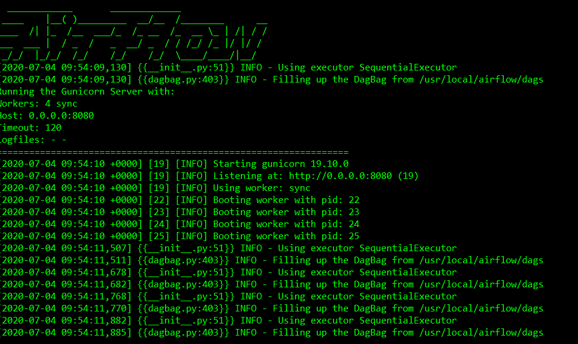
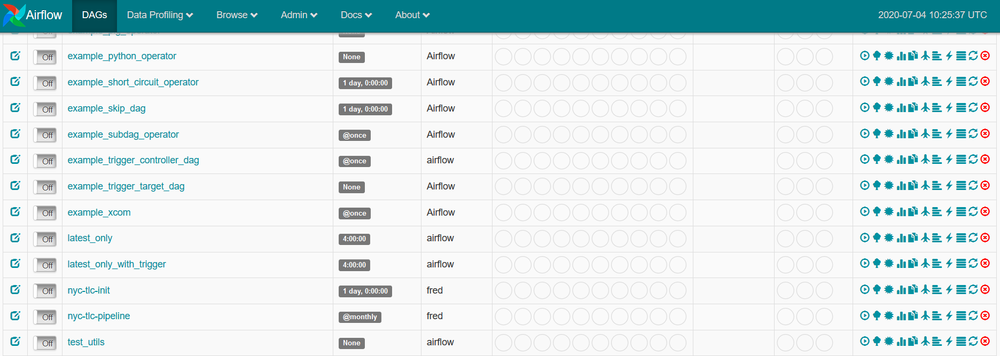
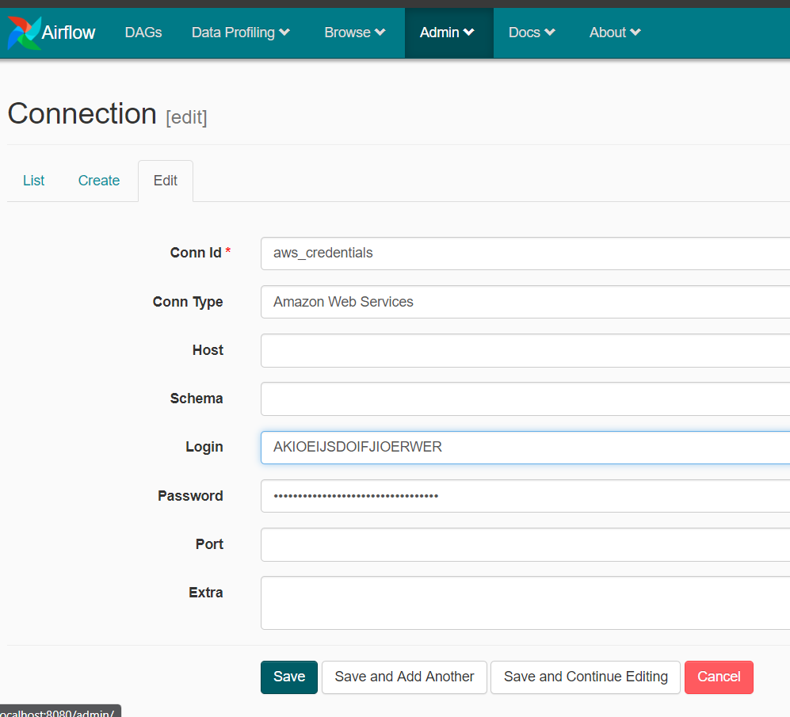
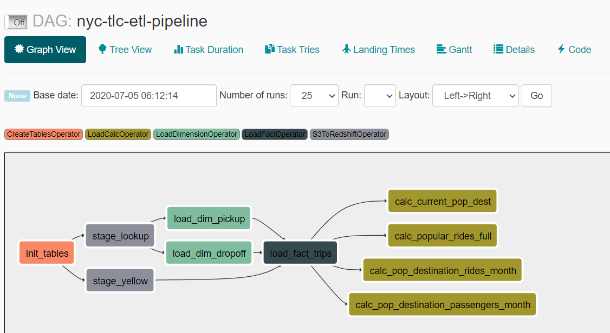
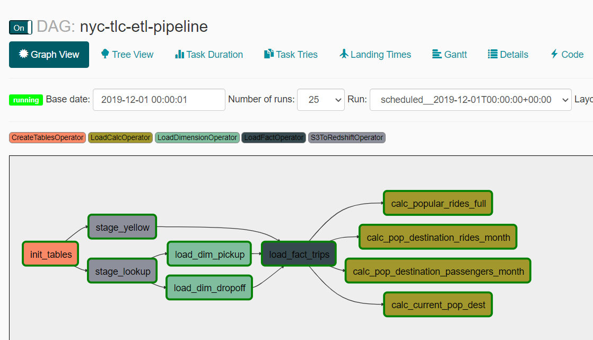
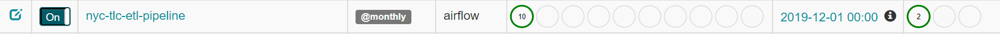
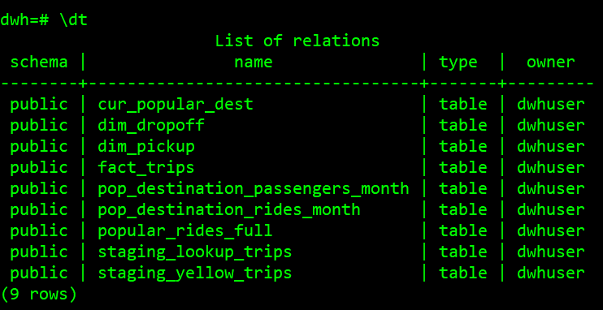
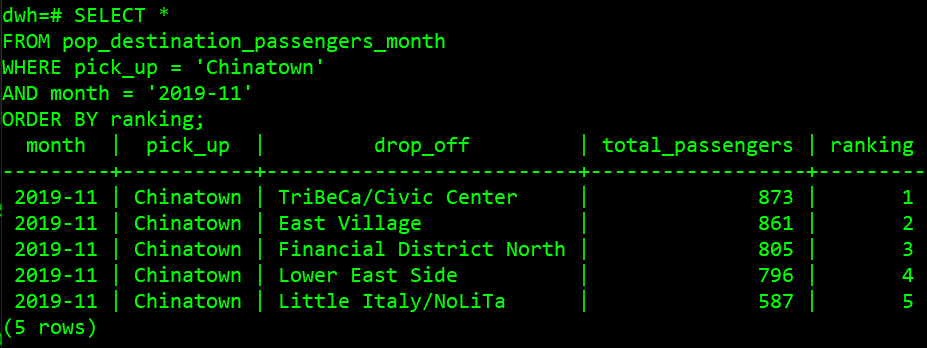
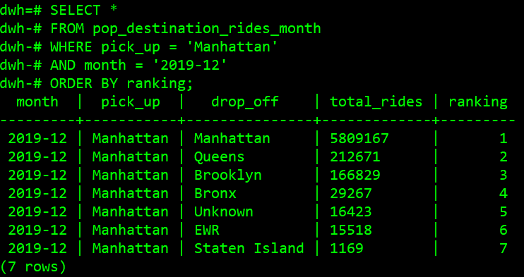
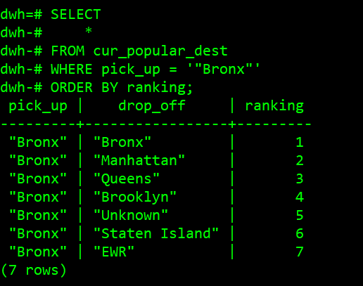

# New York Taxi Data
The New York City Taxi & Limousine Commission (NYC TLC) provides a [public data set](https://www1.nyc.gov/site/tlc/about/tlc-trip-record-data.page) about taxi rides in New York City between 2009 and 2019. In this exercise, we will create a data pipeline that collects information about popular destinations of taxi consumers for a given pick-up point. We will then do our analysis using SQL.

## Deliverables
- a Python ETL pipeline that loads data from an [S3 bucket](https://registry.opendata.aws/nyc-tlc-trip-records-pds/) into a data warehouse such as Redshift
- Airflow as the orchestration-tool that facilitates the scheduling and running of jobs
- Docker to containerize our pipeline

## Assumptions
Here are some of the assumptions I have made in doing this exercise:
- Docker and Python installed
- Yellow taxi dataset only for analysis
- Historical data is already loaded and we are only loading new monthly data
- Start date is November 2019 and end date is December 2019 (two months of loading)

## Methodology
For this exercise, we will be copying the taxi data from S3 and then load that data to Redshift. We will then be doing some SQL transformations to load into our calculated tables for our analysis. Here are the main steps:
1. Configure our connections in Airflow UI for authentication
2. Initialize the DB, copy to staging tables, load dimension and fact tables, and perform transformations using the DAG `nyc-tlc-pipeline`
3. Load new data from S3 to Redshift using Airflow as our orchestrator
4. Analyze results using SQL

## Procedure
1. Fill in the details in `template_dwh.cfg` and rename it as `dwh.cfg` after saving. Then run this command to create a virtual environment:
```
$ make build
```
2. For this exercise, we will be using Redshift to store data and run our queries for analysis. To create a cluster, we can run this command:
```
$ make cluster
```
3. While we are creating a cluster, we will be building the airflow docker container which we will be using to orchestrate the loading of data from S3 to Redshift. To do this, open another terminal and run the command:
```
$ docker build -t airflow .
```
4. After the image is built, we can create a container to start our airflow webserver using this command:
```
$ docker run -p 8000:8080 airflow
```
You will see this and it shows that the webserver has started:


On your browser, go to `localhost:8000` to see the Airflow UI, along with the DAGs that we will be using.


5. Create `aws_credentials` and `redshift` connections in airflow. Refer to your `dwh.cfg` for some of the information.




6. When cluster is created, we can now run our DAG. We do this by turning on the `nyc-tlc-init-pipeline` DAG. The **Graph View** of this DAG looks like this:



7. If everything is successful, we are now ready to do our analysis. Airflow UI will show you the successful DAG runs for November and December 2019 data.




8. To perform our analysis, we can connect to our Redshift cluster using this command:
```
$ psql "dbname= host= user= port=5439"
```
Fill in the necessary information and password when prompted.
We should be seeing our tables upon inspection.


9. In table `pop_destination_passengers_month`, we can see the top 5 zones that are popular destinations for each pick up zone by month in terms of passengers. To see which destination is popular by the most passengers from **Chinatown** in November 2019, we can run the query:
```
SELECT * 
FROM pop_destination_passengers_month
WHERE pick_up = 'Chinatown'
AND month = '2019-11'
ORDER BY ranking; 
```



10. In table `pop_destination_rides_month`, we can see the popular destinations for each pick up borough by month in terms of rides. To see which destination is popular by most rides from **Manhattan** in December 2019, we can run this query:
```
SELECT * 
FROM pop_destination_rides_month
WHERE pick_up = 'Manhattan'
AND month = '2019-12'
ORDER BY ranking; 
```



11. In table `popular_rides_full`, we can see the history of popular rides for each borough (top 10). To see the ranking for rides from **Bronx**, we can run this query:
```
SELECT
    *
FROM popular_rides_full
WHERE pick_up = 'Bronx'
ORDER BY month, ranking;
```


12. In `cur_popular_dest`, we can query the latest popular destination ranking for each borough. To see the ranking for rides from **Bronx**, we can run this query:
```
SELECT
    *
FROM cur_popular_dest
WHERE pick_up = 'Bronx'
ORDER BY ranking;
```




13. In order to add further information to the history i.e. longest/shortest trip, avg etc., the fact table should be designed to have as much needed information as possible (domain-driven design). If that's not the case, we would have to create additional columns (setting NULLs for historical) or additional tables to accommodate these changes as well as additional pipelines to load the data.

14. To create daily or yearly trends instead of monthly aggregation, if the level of aggregation compared to the available data is less granular (yearly), we can always create aggregated tables to achieve it. However, if we need more granularity, we would need to change the table design. We can also design the table on the atomic level (daily), add columns month and year, and be more flexible when it comes to granularity. Moreover, we also need to change the scheduling of the DAGs (assuming that data is available at the same frequency).

15. For clean up and deletion of cluster, run this command in the terminal:
```
$ make clean
```

## Further Steps
- Do unit/integration tests to check data quality of each step in the pipeline
- Include other taxis and add more metrics
